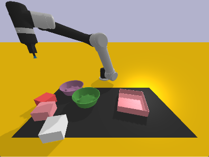
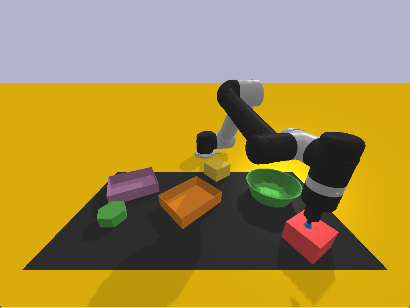
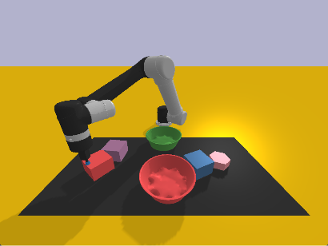

# Usage
```python
python .\cliport\demos_balanced.py n=2880 task=place-obj-in-container mode=train disp=False save_data=True
```
to enable visualization, use `disp=True`. This will:
- generate 24 * 120 demos, so basically 120 demos for each of the 24 instructions

Sample output log looks like:
```bash
python .\cliport\demos_balanced.py n=2880 task=place-obj-in-container mode=train disp=False save_data=True
...
...
Total Reward: 1.000 | Done: True | Goal: place yellow hexagon into green bowl
Done episode: 2878
Oracle demo: 2879/2880 | Seed: 126
Total Reward: 1.000 | Done: True | Goal: place yellow hexagon into green bowl
Done episode: 2879
Oracle demo: 2880/2880 | Seed: 126
Total Reward: 1.000 | Done: True | Goal: place yellow hexagon into green bowl
Done episode: 2880
Collected: {'place red block into green box', 'place red block into green bowl', 'place green hexagon into green box', 'place yellow block into red bowl', 'place yellow hexagon into red bowl', 'place yellow block into green bowl', 'place green block into red bowl', 'place green hexagon into green bowl', 'place red block into red bowl', 'place green block into green box', 'place red block into red box', 'place green block into green bowl', 'place green block into red box', 'place yellow block into red box', 'place red hexagon into red bowl', 'place red hexagon into green box', 'place green hexagon into red bowl', 'place yellow hexagon into green box', 'place yellow hexagon into green bowl', 'place green hexagon into red box', 'place yellow hexagon into red box', 'place yellow block into green box', 'place red hexagon into red box', 'place red hexagon into green bowl'}
```
**Note**:

Currently the implementation for the task is generic, in that there is a class `cliport/tasks/place-obj-in-container` that generates data satisfying the requirement.

However, I am not sure if cliport can generate "balanced" dataset natively, as it seems `demo.py` is basically sampling using a random mechanism. To remedy this, I "hardcoded" the following mechanism:

1. inside `demo_balanced.py`, I am basically looping the following:
   ```python
   while True:
        episode, total_reward = [], 0
        seed += 2

        collected = 0
        while collected < 120:
            # Set seeds.
            np.random.seed(seed)
            random.seed(seed)
			# generate data
	```
	where:
	- `collected` makes sure that each instruction has collected 120 random samples (so 20 could be used for testing)
	- inside the `while collected < 120` loop, `np.random.seed(seed)` makes sure the randomness of the current instruction is fixed

2. Then, to promote **randomness in the scene/table layout generated** even within the same instruction, I **added** the line in `place_obj_container.py`:
	```python
	def reset(self, env):
		super().reset(env)
		# some code omitted

		container_color = np.random.choice(["green", "red"])
		container =  np.random.choice(list(containers.keys()))

		obj_color = np.random.choice(["green", "red", "yellow"])
		obj = np.random.choice(list(objects.keys()))

		np.random.seed() # randomize layout regardless of the seed

		# generate layout
	```

This arguably is hardcoded, but within a limited time I think this should do.

Therefore, the requirement of 120 instructions, but each with 100 different demos are realized.

For example, in the generated dset, three of the demos under the instruction for "place red block into green bowl" has the following layout visualization:
| Demo1      | Demo2 |  Demo3    |
| ----------- | ----------- | --  |
|    |         | |

where both distractors objects are randomized in shape/color/position.

